<div align="center">


<a href="https://github.com/yourusername">
  
</a>

<br/>

[](https://www.linkedin.com/in/luis-guillermo-jr-a2a370423/)
[](mailto:luisguillermo09192@gmail.com)

<br/>

<a href="https://skillicons.dev">
  
</a>

</div>

<br/>

## 🖥️ whoami

```yaml
devops_engineer:
  nombre: Luis Guillermo J.
  rol: DevOps Engineer / SRE
  ubicacion: Remoto 🌍

  stack_favorito:
    - AWS
    - Kubernetes
    - Terraform
    - GitHub Actions & GitLab CI
    - Prometheus + Grafana
  ahora_mismo:
    aprendiendo: Escaneo SAST/DAST en pipelines, gestión de secretos con Vault y endurecimiento de manifiestos Kubernetes (Pod Security Standards)

  contacto: "ver badges de arriba ⬆️"
```

<br/>

<div align="center">


</div>

<br/>

## 🧰 Stack tecnológico

<div align="center">

**☁️ Cloud**


**📦 Contenedores & Orquestación**


**🏗️ Infraestructura como código**


**🔁 CI/CD & GitOps**


**📊 Observabilidad**


**💻 Lenguajes & Shell**


**🐧 Sistemas & Otros**


</div>

<br/>

## 📊 Nivel de especialización

<div align="center">



</div>

<br/>

## 📌 Proyectos destacados

<div align="center">
<!--
<a href="https://github.com/yourusername/nombre-repo-1">
  
</a>
<a href="https://github.com/yourusername/nombre-repo-2">
  
</a>
-->
</div>

<br/>

## 📈 Estadísticas de GitHub

<div align="center">

<picture>
  <source media="(prefers-color-scheme: dark)" srcset="https://github-readme-stats.vercel.app/api?username=yourusername&show_icons=true&bg_color=0d1117&title_color=00C6FF&text_color=c9d1d9&icon_color=00C6FF&border_color=2c5364" />
  <source media="(prefers-color-scheme: light)" srcset="https://github-readme-stats.vercel.app/api?username=yourusername&show_icons=true&bg_color=ffffff&title_color=0969da&text_color=24292f&icon_color=0969da&border_color=d0d7de" />
  
</picture>
<picture>
  <source media="(prefers-color-scheme: dark)" srcset="https://streak-stats.demolab.com/?user=yourusername&background=0d1117&border=2c5364&ring=00C6FF&fire=00C6FF&currStreakNum=ffffff&sideNums=ffffff&currStreakLabel=00C6FF&sideLabels=8b949e&dates=8b949e" />
  <source media="(prefers-color-scheme: light)" srcset="https://streak-stats.demolab.com/?user=yourusername&background=ffffff&border=d0d7de&ring=0969da&fire=0969da&currStreakNum=24292f&sideNums=24292f&currStreakLabel=0969da&sideLabels=57606a&dates=57606a" />
  
</picture>

<picture>
  <source media="(prefers-color-scheme: dark)" srcset="https://github-readme-stats.vercel.app/api/top-langs/?username=yourusername&layout=compact&bg_color=0d1117&title_color=00C6FF&text_color=c9d1d9&border_color=2c5364" />
  <source media="(prefers-color-scheme: light)" srcset="https://github-readme-stats.vercel.app/api/top-langs/?username=yourusername&layout=compact&bg_color=ffffff&title_color=0969da&text_color=24292f&border_color=d0d7de" />
  
</picture>

<picture>
  <source media="(prefers-color-scheme: dark)" srcset="https://github-profile-trophy.vercel.app/?username=yourusername&theme=tokyonight&no-frame=true&row=1&column=7&margin-w=12&margin-h=12" />
  <source media="(prefers-color-scheme: light)" srcset="https://github-profile-trophy.vercel.app/?username=yourusername&theme=flat&no-frame=true&row=1&column=7&margin-w=12&margin-h=12" />
  
</picture>

</div>

<br/>

## 🔥 Actividad reciente

<div align="center">

<picture>
  <source media="(prefers-color-scheme: dark)" srcset="https://github-readme-activity-graph.vercel.app/graph?username=yourusername&bg_color=0d1117&color=c9d1d9&line=00C6FF&point=00C6FF&title_color=00C6FF&border_color=2c5364&area=true&area_color=00C6FF" />
  <source media="(prefers-color-scheme: light)" srcset="https://github-readme-activity-graph.vercel.app/graph?username=yourusername&bg_color=ffffff&color=24292f&line=0969da&point=0969da&title_color=0969da&border_color=d0d7de&area=true&area_color=0969da" />
  
</picture>

</div>

<br/>

## 🐍 Racha de contribuciones

<div align="center">

<picture>
  <source media="(prefers-color-scheme: dark)" srcset="https://raw.githubusercontent.com/yourusername/yourusername/output/github-contribution-grid-snake-dark.svg" />
  <source media="(prefers-color-scheme: light)" srcset="https://raw.githubusercontent.com/yourusername/yourusername/output/github-contribution-grid-snake.svg" />
  
</picture>

</div>

<br/>

</div>

<br/>


<div align="center">


</div>
